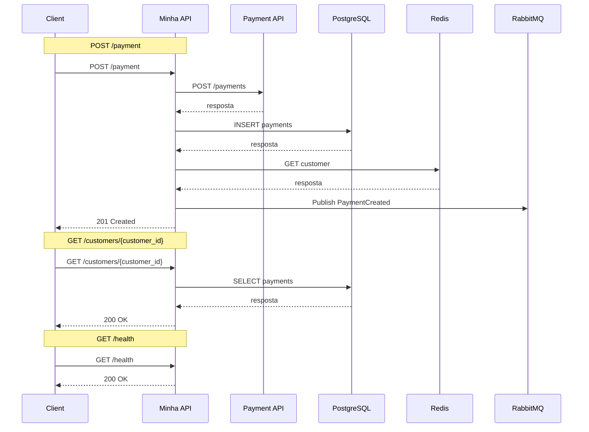
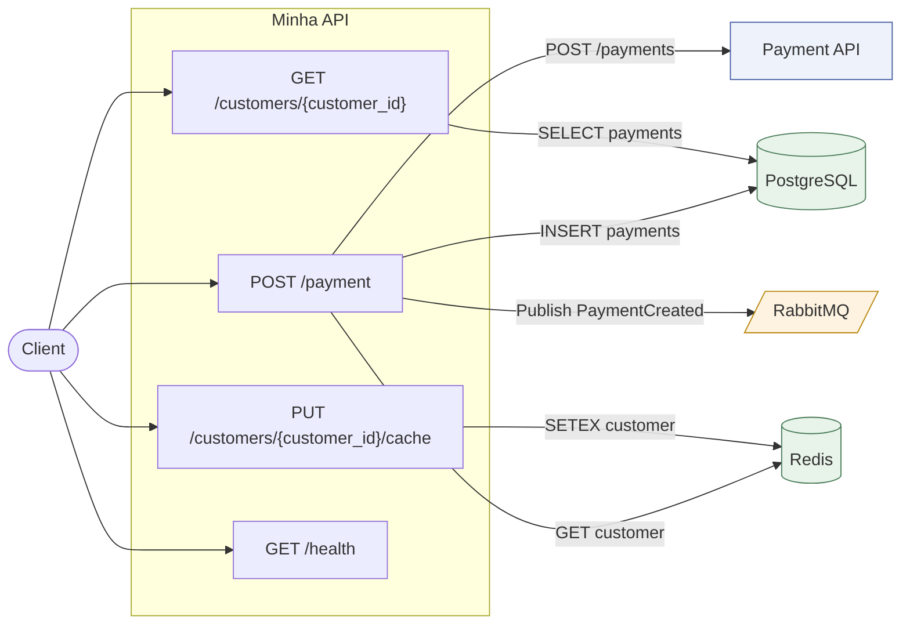
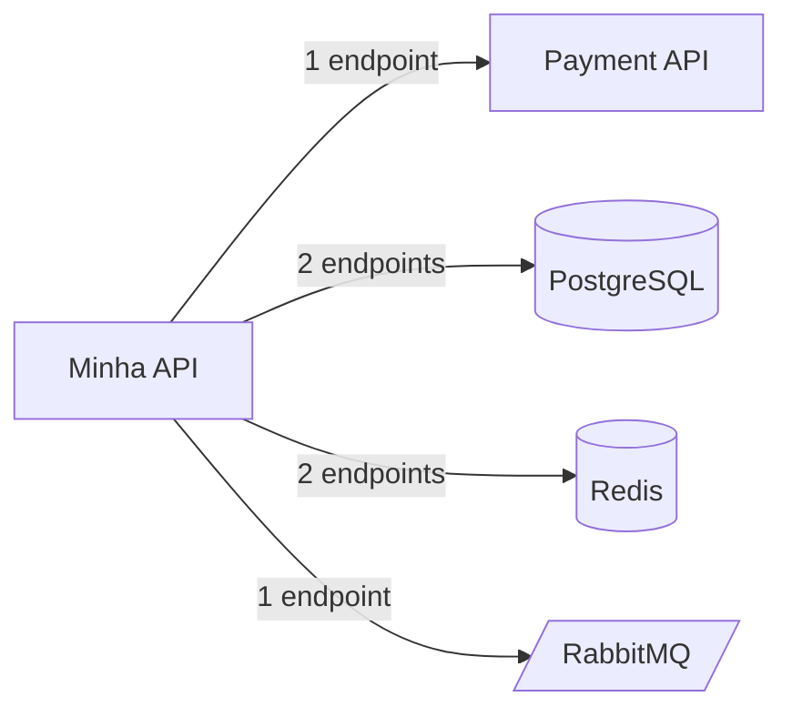

# Formato dos dois arquivos

Os exemplos abaixo são a saída real do gerador para um serviço de pagamentos com quatro endpoints. Use-os como referência quando precisar editar um `.mmd` à mão.

## 1. Diagrama de sequência — `<app>-sequence.mmd`

Um bloco por endpoint, separado por uma `Note`. Participantes declarados uma vez no topo, na ordem em que aparecem.



Regras:

- Publicação em fila **não** tem seta de volta; banco, cache, storage e API externa têm.
- Resposta ao cliente default: `201 Created` para POST, `204 No Content` para DELETE, `200 OK` no resto. Ajuste à mão quando o código disser outra coisa (`202 Accepted` em fluxo assíncrono é comum).
- Endpoint sem fronteira aparece mesmo assim — a ausência de integração é informação.
- Texto de mensagem não vai entre aspas, então `;` e `#` precisam ser removidos.

## 2. Fluxograma por endpoint — `<app>-flow.mmd`

Padrão do gerador. Mostra o recorte de cada endpoint dentro da aplicação.



## 3. Fluxograma resumo — `--flow-style summary`

Visão de contexto, útil quando há muitos endpoints ou quando o público é arquitetura/gestão.



## Escapes que quebram o Mermaid

| Situação | Solução aplicada pelo gerador |
|---|---|
| Aspas duplas no rótulo | viram `&quot;` |
| `#` em qualquer texto | vira `num ` |
| `;` em mensagem de sequência | vira `,` |
| `{param}` no path | preservado — é válido dentro de rótulo com aspas e em mensagem |
| ID de nó com hífen, ponto ou espaço | normalizado para `[A-Za-z0-9_]` |

Depois de qualquer edição manual, rode `python scripts/check_mermaid.py arquivo.mmd`.

## Onde visualizar

Os `.mmd` renderizam direto no GitHub/GitLab (bloco ```` ```mermaid ````), no VS Code com a extensão Markdown Preview Mermaid, e em https://mermaid.live. Para embutir em documentação, cole o conteúdo dentro de um bloco `mermaid` no Markdown.
